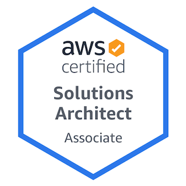

# SAA Study Guide
📚 Study Guide for the AWS Certified Solutions Architect Associate SAA-C02

## Content Domains   

Domain | % of Examination | 
---------|----------|
 Domain 1: [Design Resilient Architectures]()  | 30% | 
 Domain 2: [Design High-Performing Architectures]() | 28% | 
 Domain 3: [Design Secure Applications and Architectures]() | 24% | 
 Domain 4: [Design Cost-Optimized Architectures]() | 18% | 

-------------------------------

## Additional AWS Resources

- [Exam Guide](https://d1.awsstatic.com/training-and-certification/docs-sa-assoc/AWS-Certified-Solutions-Architect-Associate-Exam-Guide_v1.1_2019_08_27_FINAL.pdf)
- [AWS Whitepapers & Guides](https://aws.amazon.com/whitepapers/?whitepapers-main.sort-by=item.additionalFields.sortDate&whitepapers-main.sort-order=desc)
- [Sample Exam Questions](https://d1.awsstatic.com/training-and-certification/docs-sa-assoc/AWS-Certified-Solutions-Architect-Associate_Sample-Questions_v4.1_FINAL.pdf)
- [Exam Readiness](https://www.aws.training/Details/Curriculum?id=20685)
- AWS Study Tip Items
  - [AWS Well Architected ](https://aws.amazon.com/architecture/well-architected/?wa-lens-whitepapers.sort-by=item.additionalFields.sortDate&wa-lens-whitepapers.sort-order=desc)
  - Important FAQs
    - [Amazon EC2](https://aws.amazon.com/ec2/faqs/)
    - [Amazon S3](https://aws.amazon.com/s3/faqs/)
    - [Amazon VPC](https://aws.amazon.com/vpc/faqs/)
    - [Amazon Route 53](https://aws.amazon.com/route53/faqs/)
    - [Amazon RDS](https://aws.amazon.com/rds/faqs/)
    - [Amazon SQS](https://aws.amazon.com/sqs/faqs/)
  
## Additional External Resources

- [Whizlabs Practice Exams (Free/Paid)](https://www.whizlabs.com/aws-solutions-architect-associate/)
- [Udemy - 6 Practice Exam Bundle (Paid)](https://www.udemy.com/course/aws-certified-solutions-architect-associate-amazon-practice-exams-saa-c02/)
- [Tutorials Dojo Practice Exams (Free)](https://portal.tutorialsdojo.com/courses/free-aws-certified-solutions-architect-associate-practice-exams-sampler/)
- [Exam Pro/FreeCodeCamp Youtube Course (Free)](https://www.youtube.com/watch?v=Ia-UEYYR44s&feature=youtu.be)
- [A Cloud Guru Course (Paid)](https://acloud.guru/learn/aws-certified-solutions-architect-associate)

